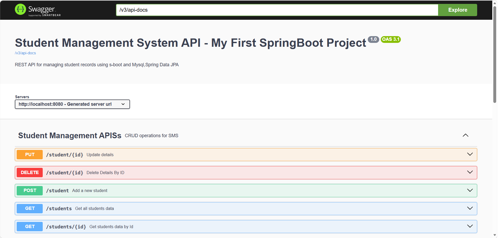

<<<<<<< HEAD
# Student-Management-System-Springboot
A simple PHP &amp; MySql CRUD application to manage records.
#TEST =======
https://student-management-system-springboot-f44c.onrender.com/swagger-ui/index.html

# Student Management System

A RESTful Student Management System built using Spring Boot and MySQL. This project provides CRUD operations for managing student records.

## 🚀 Features
- Add Student
- View All Students
- Get Student by ID
- Update Student
- Delete Student
- Exception Handling
- Swagger API Documentation

## 🛠️ Technologies Used
- Java 21
- Spring Boot
- Spring Data JPA
- MySQL
- Maven
- Swagger (OpenAPI)

## 📂 Project Structure
- Controller
- Service
- Repository
- Model
- Exception Handling
- Configuration

## ▶️ Run the Project

1. Clone the repository
2. Configure MySQL in `application.properties`
3. Run the project using Maven

## 📖 API Documentation

After starting the application, open:

http://localhost:8080/swagger-ui/index.html

## Swagger UI

## 👨‍💻 Author

**Rajat Sharma**
>>>>>>> 7692eb173fd43bfd6267a9fef6e4f52bab1f4798
